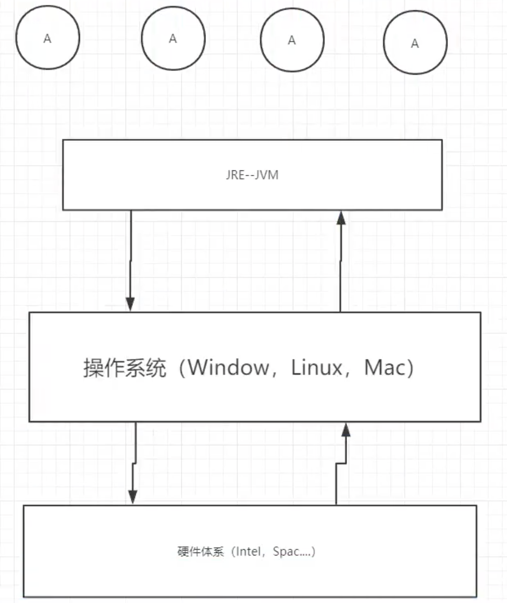
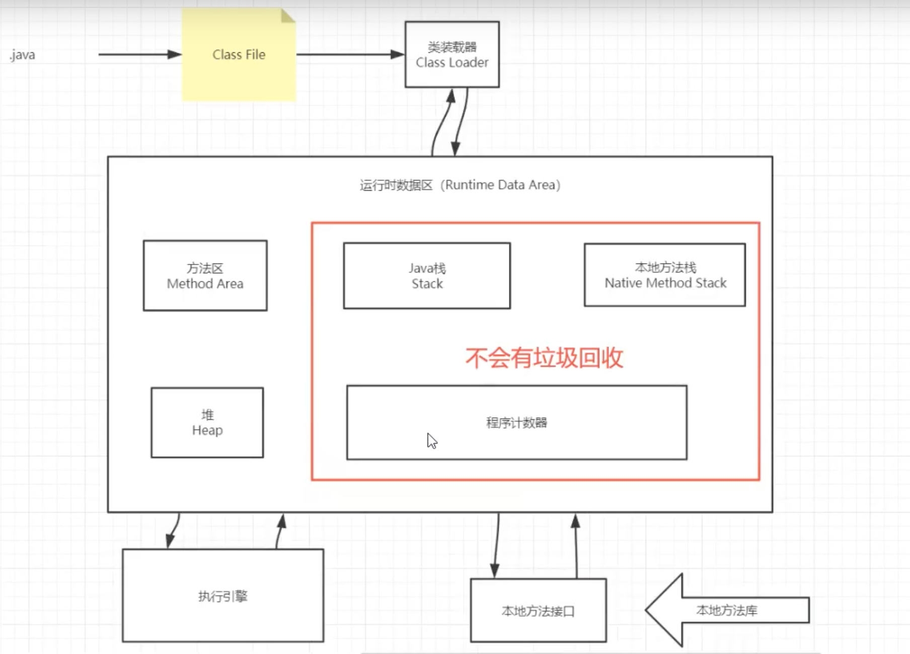

## jvm

1. jvm位置

   

2. jvm体系结构

   

   栈用完就回弹出，所以不会有垃圾，所以jvm调优一般是在堆和方法区

3. 类加载器

   作用：加载class文件

   1. 虚拟机自带的加载器
   2. 启动类（根）加载器 boot
   3. 扩展类加载器 ext
   4. 应用程序加载器 app

4. 双亲委派机制（安全）

   

   加载顺序：app->ext->boot（最终执行）

   1. 类加载器收到类加载的请求
   2. 将这个类向上委托给父类的加载器去完成，一直向上委托，直到启动类加载器
   3. 启动加载器检查是否能够加载当前这个类，能加载就结束了，使用当前加载器，否则抛出异常，通知自类加载器加载
   4. 重复3

   

## MySQL

### 语句

1. DDL

   ```sql
   create table [if not exists] `表名`(
       '字段名1' 列类型 [属性][索引][注释],
       '字段名2' 列类型 [属性][索引][注释],
       #...
       '字段名n' 列类型 [属性][索引][注释]
   )[表类型][表字符集][注释];
   
   --修改表名 :
   ALTER TABLE 旧表名 RENAME AS 新表名
   
   --添加字段 : 
   ALTER TABLE 表名 ADD字段名 列属性[属性]
   
   --修改字段 :
   ALTER TABLE 表名 MODIFY 字段名 列类型[属性]
   ALTER TABLE 表名 CHANGE 旧字段名 新字段名 列属性[属性]
   
   --删除字段
   ALTER TABLE 表名 DROP 字段名
   
   --删除数据表
   DROP TABLE [IF EXISTS] 表名
   ```

   > 字段属性

   * UnSigned：无符号的，不能为负值

   * ZEROFILL：0填充的，不足位数的用0来填充 , 如int(3),5则为005
   * Auto_InCrement：自动增长的 , 默认1，当前表设置步长(AUTO_INCREMENT=100) : 只影响当前表
   * NULL 和 NOT NULL：空与非空
   * DEFAULT：默认值

   ```sql
   -- 目标 : 创建一个school数据库
   -- 创建学生表(列,字段)
   -- 学号int 登录密码varchar(20) 姓名,性别varchar(2),出生日期(datatime),家庭住址,email
   -- 创建表之前 , 一定要先选择数据库
    
   CREATE TABLE IF NOT EXISTS `student` (
     `id` int(4) NOT NULL AUTO_INCREMENT COMMENT '学号',
     `name` varchar(30) NOT NULL DEFAULT '匿名' COMMENT '姓名',
     `pwd` varchar(20) NOT NULL DEFAULT '123456' COMMENT '密码',
     `sex` varchar(2) NOT NULL DEFAULT '男' COMMENT '性别',
     `birthday` datetime DEFAULT NULL COMMENT '生日',
     `address` varchar(100) DEFAULT NULL COMMENT '地址',
     `email` varchar(50) DEFAULT NULL COMMENT '邮箱',
     PRIMARY KEY (`id`)
   ) ENGINE=InnoDB DEFAULT CHARSET=utf8
    
   -- 查看数据库的定义
   SHOW CREATE DATABASE school;
   -- 查看数据表的定义
   SHOW CREATE TABLE student;
   -- 显示表结构
   DESC student;  
   -- 设置严格检查模式(不能容错了)
   SET sql_mode='STRICT_TRANS_TABLES';
   ```

   

2. `DML`

   ```sql
   INSERT INTO 表名[(字段1,字段2,字段3,...)] VALUES('值1','值2','值3')
   UPDATE 表名 SET column_name=value [,column_name2=value2,...] [WHERE condition];
   DELETE FROM 表名 [WHERE condition
   --用于完全清空表数据 , 但表结构 , 索引 , 约束等不变 ;
   TRUNCATE [TABLE] table_name;
   ```

   > TRUNCATE和DELETE区别

   * 都能删除数据 , 不删除表结构 , 但TRUNCATE速度更快
   * 使用TRUNCATE TABLE 重新设置AUTO_INCREMENT计数器
   * 使用TRUNCATE TABLE不会对事务有影响 

3. `DQL`

   ```sql
   SELECT [ALL | DISTINCT]
   {* | table.* | [table.field1[as alias1][,table.field2[as alias2]][,...]]}
   FROM table_name [as table_alias]
       [left | right | inner join table_name2]  -- 联合查询
       [WHERE ...]  -- 指定结果需满足的条件
       [GROUP BY ...]  -- 指定结果按照哪几个字段来分组
       [HAVING]  -- 过滤分组的记录必须满足的次要条件
       [ORDER BY ...]  -- 指定查询记录按一个或多个条件排序
       [LIMIT {[offset,]row_count | row_countOFFSET offset}]; --  指定查询的记录从哪条至哪条
   ```

   * 排序

     * ASC升序
     * DESC降序

     ```sql
     SELECT s.studentno,studentname,subjectname,StudentResult
     FROM student s
     INNER JOIN result r
     ON r.studentno = s.studentno
     INNER JOIN `subject` sub
     ON r.subjectno = sub.subjectno
     WHERE subjectname='数据库结构-1'
     ```

   * 分页

     ```sql
     /*============== 分页 ================
     语法 : SELECT * FROM table LIMIT [offset,] rows | rows OFFSET offset
     好处 : (用户体验,网络传输,查询压力)
     推导:
         第一页 : limit 0,5
         第二页 : limit 5,5
         第三页 : limit 10,5
         ......
         第N页 : limit (pageNo-1)*pageSzie,pageSzie
         [pageNo:页码,pageSize:单页面显示条数]
         
     */
      
     -- 每页显示5条数据
     SELECT s.studentno,studentname,subjectname,StudentResult
     FROM student s
     INNER JOIN result r
     ON r.studentno = s.studentno
     INNER JOIN `subject` sub
     ON r.subjectno = sub.subjectno
     WHERE subjectname='数据库结构-1'
     ORDER BY StudentResult DESC , studentno
     LIMIT 0,5
     ```

   * 聚合

     | 函数名称 | 描述                                                         |
     | -------- | ------------------------------------------------------------ |
     | COUNT()  | 返回满足Select条件的记录总和数，如 select count(*) 【不建议使用 *，效率低】 |
     | SUN()    | 返回数字字段或表达式列作统计，返回一列的总和。               |
     | AVG()    | 通常为数值字段或表达列作统计，返回一列的平均值               |
     | MAX()    | 可以为数值字段，字符字段或表达式列作统计，返回最大的值。     |
     | MIN()    | 可以为数值字段，字符字段或表达式列作统计，返回最小的值。     |

### 事务

1. ACID

   * 原子性(Atomic)：整个事务中的所有操作，要么全部完成，要么全部不完成，不可能停滞在中间某个环节。事务在执行过程中发生错误，会被回滚（ROLLBACK）到事务开始前的状态，就像这个事务从来没有执行过一样。

   * 一致性(Consist)：一个事务可以封装状态改变（除非它是一个只读的）。事务必须始终保持系统处于一致的状态，不管在任何给定的时间并发事务有多少。

   * 隔离性(Isolated)：隔离状态执行事务，使它们好像是系统在给定时间内执行的唯一操作。如果有两个事务，运行在相同的时间内，执行相同的功能，事务的隔离性将确保每一事务在系统中认为只有该事务在使用系统。

   * 持久性(Durable)在事务完成以后，该事务对数据库所作的更改便持久的保存在数据库之中，并不会被回滚。

     

### MyISAM和InnoDB

1. 基本区别

   |            | MyISAM      | InnoDB        |
   | ---------- | ----------- | ------------- |
   | 事务支持   | 不支持      | 支持          |
   | 数据行锁   | 不支持 表锁 | 支持 行锁     |
   | 外键约束   | 不支持      | 支持          |
   | 全文索引   | 支持        | 不支持        |
   | 表空间大小 | 较小        | 较大，约为2倍 |

   * `MyISAM`：节约空间，速度较快
   * `InnoDB`：安全性高，事务处理，多表多用户

   数据库本质还是文件存储

2. `MySQL`引擎在物理文件上的区别

   * 表文件
     * \* . frm -- 表结构定义文件
     * \* . MYD -- 数据文件 ( data )
     * \* . MYI -- 索引文件 ( index )

   * `InnoDB` 在数据库表中只有一个.frm文件，, 以及上一级目录的ibdata1文件
   * `MyISAM `类型数据表对应三个文件 


