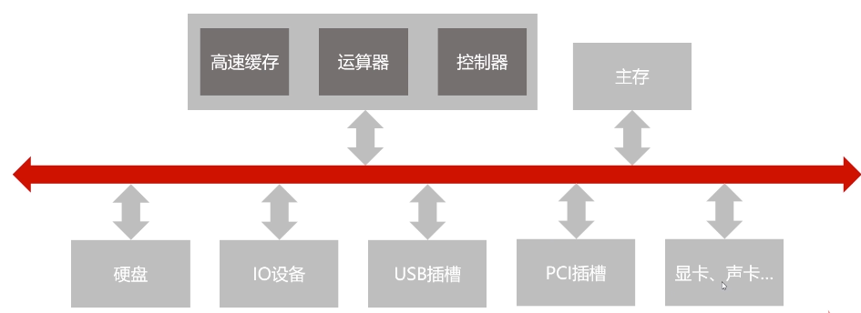

# 计算机基础

  

## 1. 计算机组成原理

### 1.1 背景

#### 1.1.1 体系结构

1. 冯诺依曼体系：将程序指令和数据一起储存的计算机设计概念结构

   之前的计算机如果要切换程序，需要重新设计电路和编写程序

   冯诺依曼体系本质：储存程序指令，设计通用电路

   * 包含：存储器，控制器，运算器，输入设备，输出设备
   * `cpu` = 控制器+运算器
   * 冯诺依曼瓶颈：存储器和cup分离，速率之间无法调和
2. 现代计算机的结构

   解决cpu与存储设备间的性能差异问题（冯诺依曼瓶颈）

   * `cpu`=控制器+运算器+储存器（一般指更高速的设备：内存和寄存器）

#### 1.1.2 计算机层次

1. 应用层
2. 高级语言层
3. 汇编语言层：
   * 编程语言是汇编语言
   * 汇编语言可以翻译成可以直接执行的机器语言
   * 完成翻译的过程的程序就是汇编器
4. 操作系统层：
   * 向上提供简易的操作界面
   * 向下对接了指令系统，管理硬件资源
   * 操作系统层是在软件和硬件之间的适配层
5. 传统机器层：
   * 编程语言是CPU指令集（机器指令）
   * 编程语言和硬件直接相关
   * 不同架构的cpu使用不同的cpu指令集
   * 一条机器指令对应一个微程序
6. 微程序机器层：
   * 编程语言是微指令集
   * 微指令组成的微程序直接交由硬件执行
   * 一个微程序对应一组微指令
7. 硬件逻辑层：门电路，触发器等组成

实际机器：5~7

虚拟机器：1~4

系统软件：2~4

#### 1.1.3 编程语言分类

1. 程序翻译：较为高级的语言生成同等逻辑的较为低级的语言，需要编译器来实现（c/c++，oc，go）
2. 程序解析：较为高级的语言作为输入，运行在较为低级的语言写出的程序上，需要解释器来实现（python， js，php）
3. 程序翻译+解析：首先闲翻译程序，然后在解析运行（java，c#）

#### 1.1.4 计算机计算单位

1. 容量单位
   * 在物理层面，高低电平记录信息
   * 理论上值认识0/1两种状态（0/1称为bit，比特位）
   * bit表示数据太少，用字节来储存数据，字节：1 Byte = 8 bits

2. 速度单位
   1. 网络速度（宽带用）：100M/s = 100Mbps = 100Mbit/s =(100/ 8 )Mb/s = 12.5MB/s
   2. CPU速度
      * 一般指cpu时钟频率
      * 单位一般是赫兹（Hz），Hz = 1/s，每秒周期变换次数的计量
      * 常用电脑一般大于2GHz，2GHz = $2\cdot1000^3$Hz = 每秒20亿次

#### 1.1.5 计算机的字符和编码集

1. `ASCII码`
   * 使用7个bit就可以完全表示，$2^8$  = 128
   * 95个可打印字符
   * 33个不可打印字符（包括控制字符）
2. `Extended ASCII 码`
   * 用8个bit位标识，扩展为$2^8$ = 256个字符
   * 包含常见数学运算符，带音标的欧洲字符，其他常用符、表格符等
3. 中文编码集
   * 会出现问题，如果电脑没有安装对应编码集（英文os可能会没有），会乱码
   * windows中文默认为GBK编码
   * GB2312（《信息交换用汉字编码字符集——基本集》），共收录了7445个字符，包括了6763个汉字和其他682个其他符号，但是不支持国际标准
   * GBK（《汉字内码扩展规范》），向下兼容GB2312，向上支持国际ISO标准，共收录21003个汉字，支持全部中日韩汉字
4. Unicode（万国码）
   * 定义了世界通用的符号集，`UTF-*`实现了编码
   * 推荐使用的编码

### 1.2 组成

#### 1.2.1 计算机总线

1. 概述

   为了解决不同设备之间的通信问题，常用的总线usb，pci，isa，Thunderbolt...

   cpu中没有总线的话，每一部分都需要连接一根线，如果加入一个设备，又需要和其他设备再连接一次，有了io总线之后，所有设备都连接在一起了

2. 分类

   1. 片内总线：芯片内部的总线，寄存器之间的连接，寄存器与控制器、运算器之间连接
   2. 系统总线：连接各个硬件的总线
      1. 数据总线
         * 双向传输各个部件的数据信息
         * 一般和cpu位数相同
      2. 地址总线
         
         * 用于传输地址，指定元数据或目的数据在内存中的地址
         * 地址总线位数为n，寻址范围为2^2^
      3. 控制总线
         * 控制总线式用来发出各种控制想好的传输线
         * 控制信号经由控制总线从一个组件发给一个组件
         * 控制总线可以监视不同组件之间的状态（就绪/未就绪）
   
3. 总线的仲裁

   比如主存要使用硬盘和IO设备交换数据，这时硬盘和IO数据都准备就绪了，总线该交由谁用？

   仲裁（仲裁控制器）是为了解决各个设备之间使用总线的优先顺序，解决冲突问题

   1. 链式查询：多个设备连接仲裁器，如果多个设备同时仲裁，根据链来仲裁使用权
      * 好处：电路复杂度低
      * 坏处：优先级低的设备难以获得总线使用权，对于电路故障比较敏感
   2. 计时器定时查询：分别连接，谁要请求使用，谁发起仲裁，然后仲裁器发对应的信号，然后设备判断信号来使用
      * 仲裁控制器对设备编号，并使用计数器累计计数
      * 接收到仲裁信号后，往所有设备发出计数值
      * 计数值与设备编号一致则获得总线使用权
   3. 独立请求
      * 每个设备均有总线独立连接仲裁器
      * 设备可单独向仲裁器发送请求和接受请求
      * 当收到多个请求型号时，仲裁器有权按优先级分配使用权
      * 好处：响应速度快，优先书勋可动态改变
      * 设备连线多，总线控制复杂

#### 1.2.9 计算机指令的执行过程

1. 指令执行过程（左边为运算器，右上角为高速缓存，右下角为控制器，通过总线连接）

   1. 首先将数据和指令写到高速缓存里
   2. 程序计数器记录当前需要执行的指令（101）
   3. 指令通过总线来到了指令寄存器
   4. 指令寄存器将指令发送到指令译码器里，然后程序寄存器+1，移向下一条指令（102）
   5. 指令译码器译码之后（明白指令的意思后），发出控制信号传递给运算器
   6. 运算器得到指令后，将R0传入ALU中，然后ALU将数据传入数据缓存器
   7. 数据缓存器将数据覆盖到R1中

   **一般过程**

   1. 取指令
      1. 从缓存取指令
      2. 送到指令寄存器
   2. 分析指令
      1. 指令译码器译码
      2. 发出控制信号
      3. 程序计数器+1
   3. 执行指令
      1. 装在数据到寄存器
      2. ALU处理数据
      3. 记录运算状态（溢出，进位等）
      4. 送出运算结果

2. CPU流水线

   CPU执行过程中，运算器和控制器不能同时工作，导致利用率降低

   百度百科： cpu流水线技术 是一种将指令分解为多步，并让不同指令的各步操作重叠，从而实现几条指令 并行处理 ，以加速程序运行过程的技术。 

### 1.3 计算

## 2. 操作系统

## 3. 计算机网络